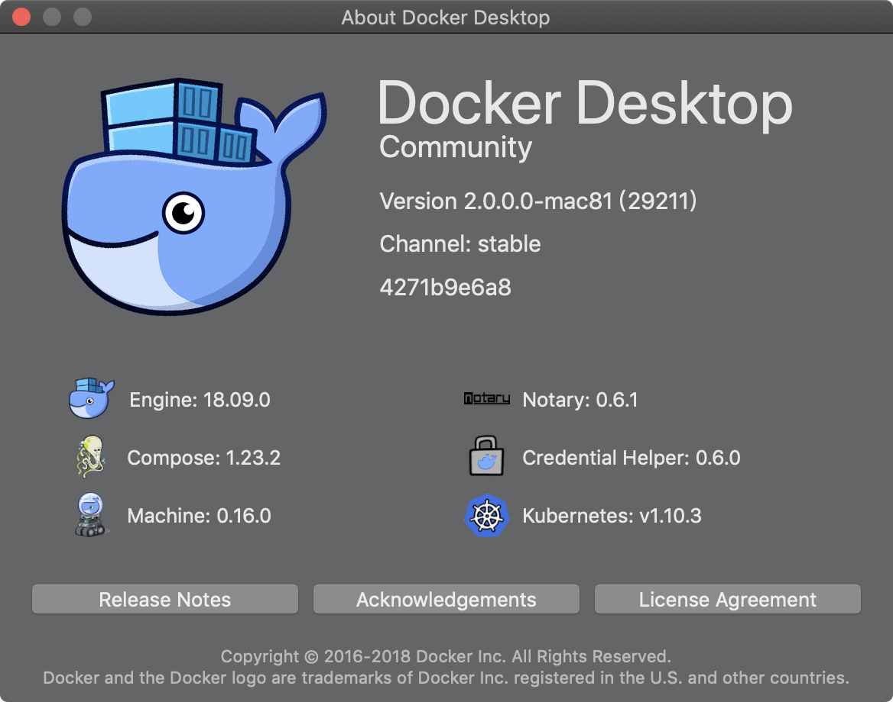
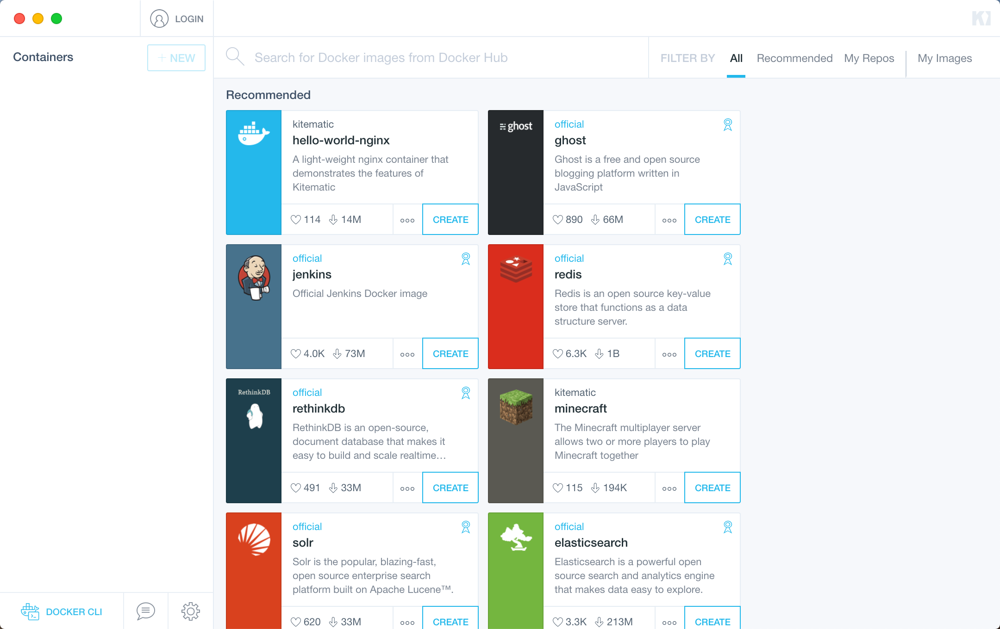
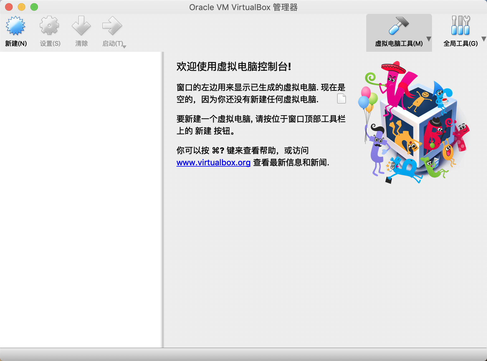

## macOS 安装 Docker

#### 安装 Docker

Docker 是一个开放源代码软件项目，让应用程序布署在软件货柜下的工作可以自动化进行，借此在 Linux 操作系统上，提供一个额外的软件抽象层，以及操作系统层虚拟化的自动管理机制。 Docker 利用 Linux 核心中的资源分离机制，例如 cgroups，以及 Linux 核心名字空间，来创建独立的容器。

文件链接：[点击下载](https://download.docker.com/mac/stable/Docker.dmg)。

安装完成后，可至 [Docker Hub](https://hub.docker.com) 免费注册一个 Docker 账号。Docker Hub 是 Docker 官方维护的公共仓库，包括了 180 多万个可用镜像。大部分需求都可以通过在 Docker Hub 中直接下载镜像来实现。



#### 安装 Kitematic

Kitematic 是一个 Docker GUI 工具，它可以在 Mac 上更快速、更简单的运行 Docker。Kitematic 于 2015 年被 Docker 收购。

文件链接：[点击下载](https://download.docker.com/kitematic/Kitematic-Mac.zip)。



## macOS 安装虚拟机

#### 安装 VirtualBox

VirtualBox 是针对基于 x86 的系统的强大的跨平台虚拟化软件。“跨平台”意味着它可以安装在 Windows、Linux、Mac OS X 和 Solaris x86 计算机上。而“虚拟化软件”则意味着可以在同一台计算机上同时创建和运行多个虚拟机，并且这些虚拟机可以运行不同的操作系统。例如，可以在 Mac 上同时运行 Windows 和 Linux，在 Windows PC 上同时运行 Linux 和 Solaris，或者在 Linux 系统上运行 Windows。

文件链接：[点击下载](https://download.virtualbox.org/virtualbox/5.2.22/VirtualBox-5.2.22-126460-OSX.dmg)。

当前版本为 `5.2.22`，最新版本可至 [官网下载](https://www.virtualbox.org)。



#### 安装 Vagrant

Vagrant 是一款用于构建及配置虚拟开发环境的软件，基于 Ruby, 主要以命令行的方式运行。 主要使用 Oracle 的开源 VirtualBox 虚拟化系统，与 Chef，Salt，Puppet 等环境配置管理软件搭配使用，可以实行快速虚拟开发环境的构建。

文件链接：[点击下载](https://releases.hashicorp.com/vagrant/2.2.2/vagrant_2.2.2_x86_64.dmg)。

当前版本为 `2.2.2`，最新版本可至 [官网下载](https://www.vagrantup.com/)。

安装完成后，以安装 CentOS 7 为例，执行以下命令：

```bash
# cd 到某个自定义的目录
# 生成 Vagrantfile 配置文件
vagrant int centos/7 
# 根据配置文件安装虚拟机，首次安装需要下载系统镜像，可能较慢，建议翻墙。
vagrant up  
```

现阶段，Vagrant 常用命令还有：

```bash
# 查看虚拟机状态
vagrant status
# 删除虚拟机
vagrant destroy
# 登录虚拟机
vagrant ssh
```

其他 vagrant 命令详见 [官方文档](https://www.vagrantup.com/docs/index.html)。

## CentOS 安装 Docker

#### 登录虚拟机
```bash
vagrant ssh
```

#### 卸载旧的 Docker 版本

```bash
sudo yum remove docker docker-client docker-client-latest docker-common docker-latest docker-latest-logrotate docker-logrotate docker-selinux docker-engine-selinux docker-engine
```

#### 安装依赖包

```bash
sudo yum install -y yum-utils device-mapper-persistent-data lvm2
```

#### 配置 yum 源

```bash
sudo yum-config-manager --add-repo https://download.docker.com/linux/centos/docker-ce.repo
```

#### 安装 Docker

```bash
sudo yum install docker-ce
```

#### 添加用户到组

将登录用户 vagrant 加入到 docker 组中，这样执行 docker 相关命令就不用再用 sudo。
```bash
sudo gpasswd -a vagrant docker
```

#### 启动 Docker

```bash
sudo systemctl start docker
```

#### 检查 Docker 环境是否正常工作

```bash
docker run hello-world
```

如果返回信息里出现 `Hello from Docker!`，则表明 Docker 环境安装成功。

安装详情可参考官方文档：[Get Docker CE for CentOS](https://docs.docker.com/install/linux/docker-ce/centos/#install-using-the-repository)。

上述命令也可写入 Vagrantfile 文件中，然后执行 `vagrant up`，即可在完成新建虚拟机后，自动执行并构建 Docker 环境。详见 [示例文件第 66 行至 72 行](./Vagrantfile)。

至此，我们的环境已经搭建完毕，除了使用 Vagrant 管理虚拟机，我们还可以使用 Docker for Mac 自带的 docker-machine 来创建 Docker 应用环境。

