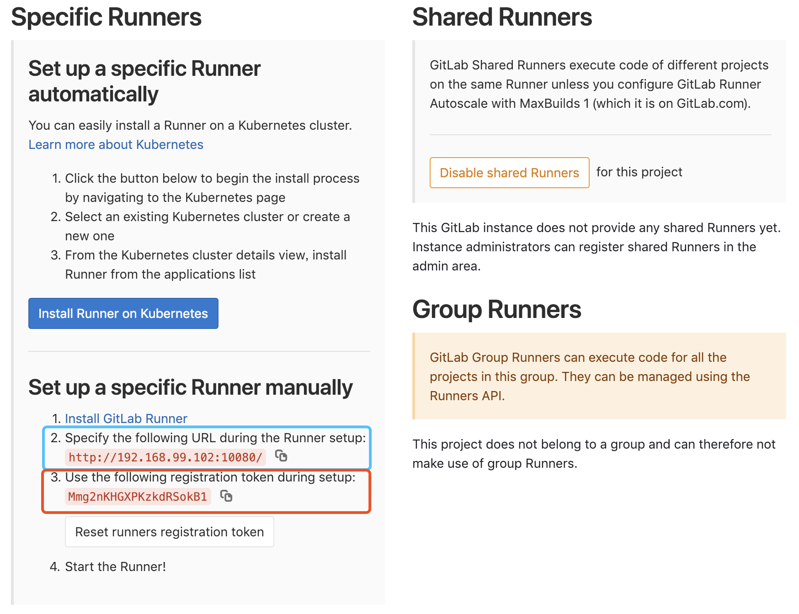

#### gitlab

```bash
# 使用本地缓存iso文件
docker-machine create gitlab --virtualbox-boot2docker-url=/Users/<your-username>/.docker/machine/cache/boot2docker.iso
docker-machine create ci --virtualbox-boot2docker-url=/Users/<your-username>/.docker/machine/cache/boot2docker.iso
```

登录 gitlab machine

```bash
docker-machine ssh gitlab
```
```
sudo curl -L "https://github.com/docker/compose/releases/download/1.23.1/docker-compose-$(uname -s)-$(uname -m)" -o /usr/local/bin/docker-compose
sudo chmod +x /usr/local/bin/docker-compose
```
```
# https://github.com/sameersbn/docker-gitlab
wget https://raw.githubusercontent.com/sameersbn/docker-gitlab/master/docker-compose.yml
docker-compose up -d
```

登录 ci machine

https://docs.gitlab.com/runner/register/index.html#docker

```
docker-machine ssh ci
```
```
docker pull gitlab/gitlab-runner
```
```
docker run -d -v /srv/gitlab-runner/config:/etc/gitlab-runner --name gitlab-runner gitlab/gitlab-runner register \
  --non-interactive \
  --executor "docker" \
  --docker-image alpine:3 \
  --url "http://192.168.99.102:10080/" \
  --registration-token "Mmg2nKHGXPKzkdRSokB1" \
  --description "docker-runner" \
  --tag-list "docker" \
  --run-untagged \
  --locked="false"

```


--url 和 --registration-token 从 gitlab 项目 -> settings -> CI/CD -> Runners 获取
