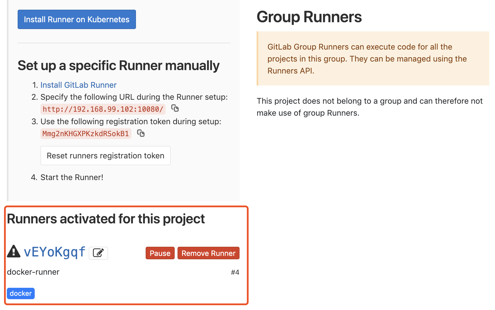

## gitlab & gitlab-runner

> 此教程为本地环境，生成环境的配置相似。

首先在本地通过 docker-machine 创建两台 machine，分别运行 gitlab 和 gitlab-runner：

```bash
docker-machine create gitlab
docekr-machine create gitlab-runner

# 如果，你事先已下载好 boot2docker.iso 文件，可以添加以下参数来使用本地缓存 ISO 文件安装：
docker-machine create gitlab --virtualbox-boot2docker-url=/Users/<your-username>/.docker/machine/cache/boot2docker.iso
docker-machine create gitlab-runner --virtualbox-boot2docker-url=/Users/<your-username>/.docker/machine/cache/boot2docker.iso

# 查看 machine 列表，获取两台 machine 自动分配的 ip
docker-machine ls
```

#### 安装 gitlab 服务

登录 gitlab machine:

```bash
docker-machine ssh gitlab
```

安装 docker-compose:

```
sudo curl -L "https://github.com/docker/compose/releases/download/1.23.1/docker-compose-$(uname -s)-$(uname -m)" -o /usr/local/bin/docker-compose
sudo chmod +x /usr/local/bin/docker-compose
```

安装 gitlab，我推荐使用 [sameersbn/docker-gitlab](https://github.com/sameersbn/docker-gitlab)：
```
# 下载 docker-compose.yml 文件
# https://github.com/sameersbn/docker-gitlab
wget https://raw.githubusercontent.com/sameersbn/docker-gitlab/master/docker-compose.yml

# 后台 up：
docker-compose up -d
```

#### 安装 gitlab-runner 服务

官方教程：https://docs.gitlab.com/runner/register/index.html#docker

登录 gitlab-runner machine:

```
docker-machine ssh gitlab-runner
```

拉取镜像：

```
docker pull gitlab/gitlab-runner
```

运行容器：

```
docker run -d -v /srv/gitlab-runner/config:/etc/gitlab-runner --name gitlab-runner gitlab/gitlab-runner register \
  --non-interactive \
  --executor "docker" \
  --docker-image alpine:3 \
  --url "http://192.168.99.102:10080/" \
  --registration-token "Mmg2nKHGXPKzkdRSokB1" \
  --description "docker-runner" \
  --tag-list "docker" \
  --run-untagged \
  --locked="false"
```


--url 和 --registration-token 从 gitlab 项目 -> settings -> CI/CD -> Runners 获取。

容器运行成功后，查看页面：




