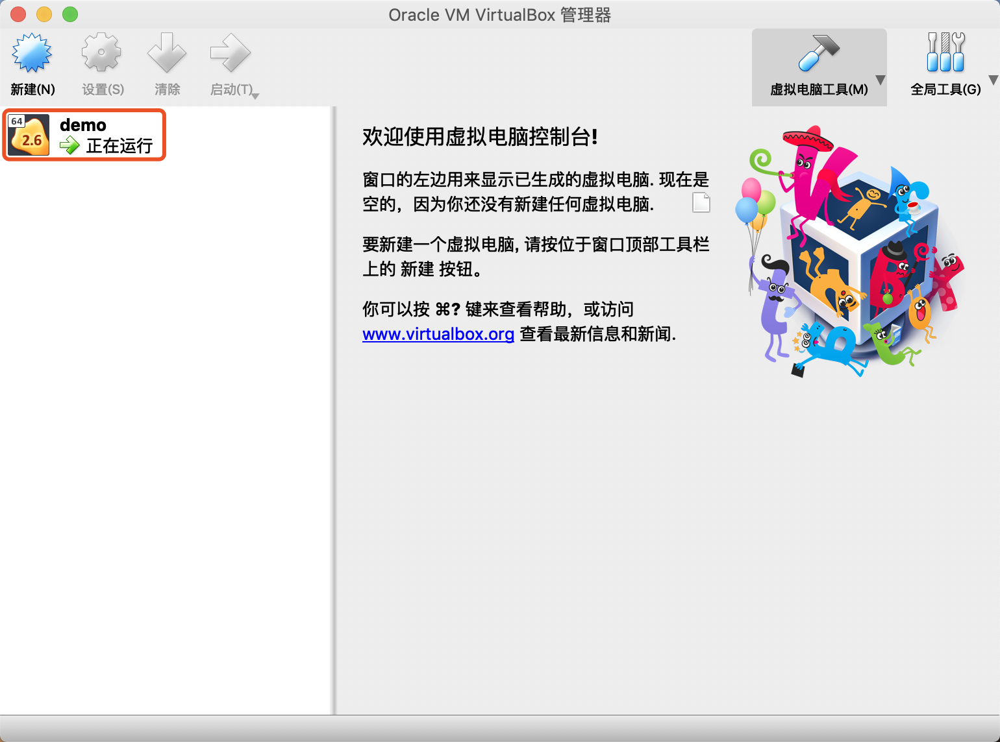
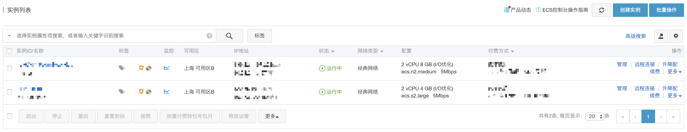

## Docker Machine

Docker Machine 是 Docker 官方提供的一个工具，它可以帮助我们在远程的机器上安装 Docker，或者在虚拟机 host 上直接安装虚拟机并在虚拟机中安装 Docker。我们还可以通过 docker-machine 命令来管理这些虚拟机和 Docker。

我们在安装 Docker for Mac 的时候已经集成好了。通过 `docker-machine version` 可查看 Docker Machine 版本。

#### 本地使用

```bash
docker-machine create machine-local-demo
```

上述命令会从 Github 仓库 [boot2docker](https://github.com/boot2docker/boot2docker) 下载 boot2docker（一款运行 Docker 最小的内核） ISO 文件，进而创建一个装有 Docker 环境的虚拟机。创建完成后，VirtualBox 界面左侧列表会显示出一个名为`demo`的虚拟机，如下图所示。



```bash
# 查看已创建的虚拟机列表
docker-machine ls
```

```bash
# 登录虚拟机
docker-machine ssh machine-local-demo
```

```bash
# 停止
docker-machine stop machine-local-demo
# 启动
docker-machine start machine-local-demo
# 删除
docker-machine rm machine-local-demo

# 停止所有 machine
docker-machine stop $(docker-machine ls -q)
# 启动所有 machine
docker-machine start $(docker-machine ls -q)
```

#### 云端使用

这里以[阿里云ECS驱动](https://github.com/AliyunContainerService/docker-machine-driver-aliyunecs)为例。更多云服务商，请参考[第三方云服务商驱动列表](https://github.com/docker/docker.github.io/blob/master/machine/AVAILABLE_DRIVER_PLUGINS.md)。

首先，执行一下命令，安装本地驱动：

```bash
# 获取二进制文件
wget https://docker-machine-aliyunecs-drivers.oss-cn-beijing.aliyuncs.com/docker-machine-driver-aliyunecs_darwin-amd64.tgz
# 解压文件
tar zxvf docker-machine-driver-aliyunecs_darwin-amd64.tgz
# 复制并重命名到指定目录下
cp ./bin/docker-machine-driver-aliyunecs.darwin-amd64 /usr/local/bin/docker-machine-driver-aliyunecs
```

然后，新建 Machine：

```bash
docker-machine create -d aliyunecs \
                      --aliyunecs-io-optimized=optimized \
                      --aliyunecs-instance-type=ecs.n4.small \
                      --aliyunecs-access-key-id=xxxxxxxxxx \
                      --aliyunecs-access-key-secret=xxxxxxxxxx \
                      --aliyunecs-region=cn-hangzhou \
                      machine-aliyunecs-demo
```

 * `--aliyunecs-io-optimized`      实例的I/O 优化类型，有效值可以是`none`（默认）或`optimized`；
 * `--aliyunecs-instance-type`     实例的类型，默认值为`ecs.n4.small`，实际值请在阿里云控制台查询；
 * `--aliyunecs-access-key-id`     实例的 key-id，实际值请在控制台`产品与服务`中选择`访问控制`新建用户获取；
 * `--aliyunecs-access-key-secret` 实例的 key-secret，实际值请在控制台`产品与服务`中选择`访问控制`新建用户获取；
 * `--aliyunecs-region`            实例的地域（新建实例时选择的地域），默认值为 `cn-hangzhou`，实际值请在阿里云控制台查询，并依据[阿里云地域（Region）列表](https://help.aliyun.com/document_detail/40654.html)转换。
 
 
 
 上图为阿里云控制台示例，参数值请自行登录阿里云控制台获取。
 
最后，连接 Server 环境：
 
 ```bash
 docker-machine env machine-aliyunecs-demo
 ```
 ```bash
 eval $(docker-machine env machine-aliyunecs-demo)
 ```