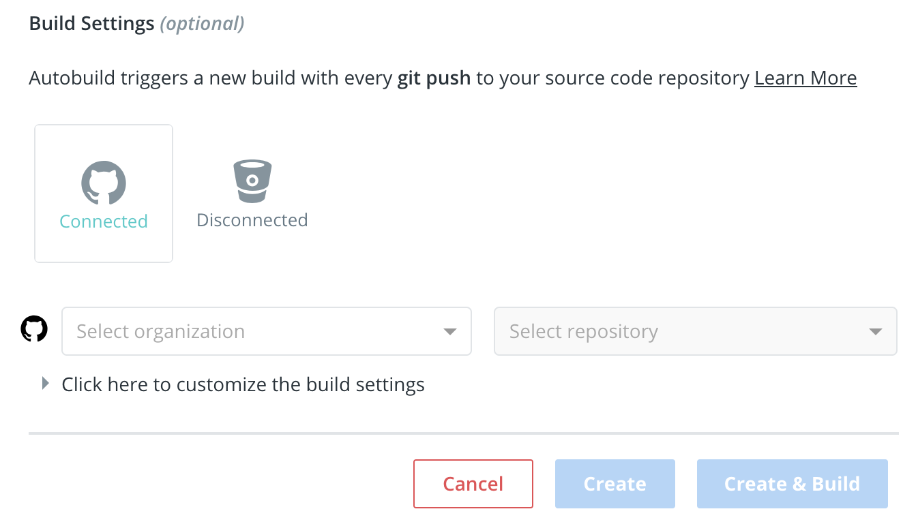

#### 从 Docker Hub 拉取镜像
```bash
# 拉取镜像
docker pull ubuntu:14.04
# 镜像列表
docker image ls
```

#### 本地构建镜像

```bash
mkdir hello-docker
cd hello-docker
vi main.c
```
写入以下代码：
```c
#include<stdio.h>
int main()
{
    printf("hello docker\n");
}
```
编译：
```bash
sudo yum -y install gcc glibc-static
gcc -static main.c -o main
```

```
vi Dockerfile
```
在 Dockerfile 写入：
```
FROM scratch
ADD main /
CMD ["/main"]
```

构建：

```bash
docker build -t jxlwqq/hello-docker .
```
镜像列表：
```bash
docker image ls
```
返回值：
```
REPOSITORY            TAG                 IMAGE ID            CREATED              SIZE
jxlwqq/hello-docker   latest              8f4d70fe988a        About a minute ago   857kB
ubuntu                14.04               f17b6a61de28        4 weeks ago          188MB
hello-world           latest              4ab4c602aa5e        3 months ago         1.84kB
```

```bash
docker history 8f4d70fe988a # IMAGE ID
```
```
IMAGE               CREATED             CREATED BY                                      SIZE                COMMENT
8f4d70fe988a        2 minutes ago       /bin/sh -c #(nop)  CMD ["/main"]                0B                  
11b5f8ea8ee1        2 minutes ago       /bin/sh -c #(nop) ADD file:90db8d97695a893b7…   857kB                          
```

删除镜像：
```bash
docker image rm -f hello-docker
```

#### 发布镜像

方法一：

不推荐，镜像构建过程不透明，无法确认安全性。
```bash
docker login # Docker Hub 账号密码
docker push jxlwqq/hello-docker
```
方法二：

与其分享 Docker image，不如分享构建 image 的 Dockerfile。
将 Dockerfile 发布到 GitHub 仓库上，然后关联 GitHub 账号，选择对应的仓库，Docker Hub 将会自动克隆并构建。

https://cloud.docker.com/repository/create



#### 搭建私有仓库


